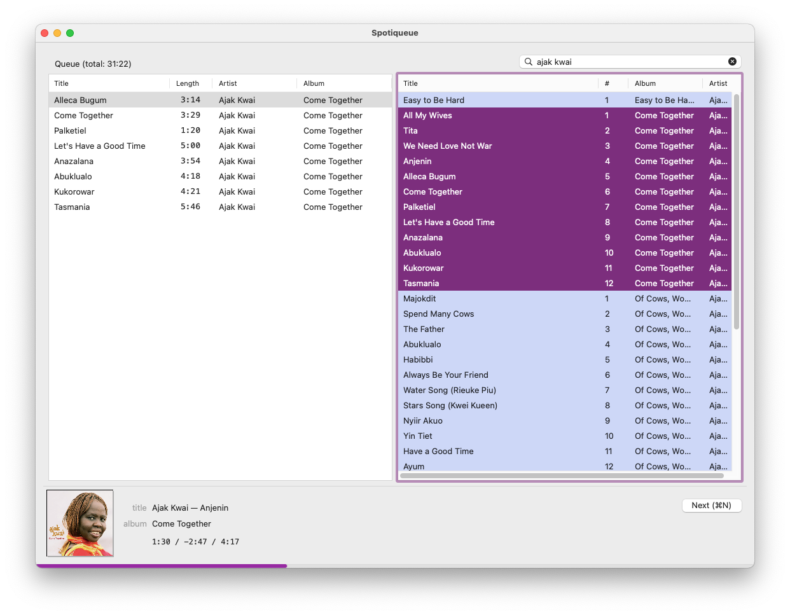

# Spotiqueue

A terribly simple macOS app for keyboard-based, queue-oriented Spotify use.  Many years ago i built
a version which relied on a now-deprecated library — Spotify doesn't publish `libspotify` any more,
which is a shame.  The old Spotiqueue is [archived for
posterity](https://github.com/toothbrush/spotiqueue-old); this version does pretty much exactly the
same as the old one did, and more, although i'd like to think it's a bit more refined.

Spotiqueue now also has the [GNU Guile](https://www.gnu.org/software/guile/) extension language
built in: this means you can extend its behaviour with arbitrary Scheme!  More details below.
Beware of rough edges. Scratches my itch, no other guarantees granted.



## Usage, a crash course

Spotiqueue is intended to be keyboard-driven.  As such, you may be surprised that clicking and
dragging doesn't work.  Read on for instructions!

The left-hand pane is your queue of tracks to be played.  The top track is next, and once it has
started playing, it's removed from the queue.  The right-hand pane is for search results.

* **Searching**: To search, enter text (such as `britney spears` or `sandstorm`) into the search
  field, and press `⏎` (Return, Enter, whatever you call it).  This will focus the search results
  pane and tracks matching your query will start to populate.  There's also a filter field at the
  bottom of the search pane — it understands Regex and will narrow the search results.
* **Navigating**: Use the arrow keys to navigate: up and down, or press the left arrow to select the
  queue, or the right arrow to select the search results pane.  Use shift to select multiple items.
* **Playing**: Pressing `⏎` (Return) on a single item plays it immediately.  Pressing `⏎` with
  multiple tracks selected adds them to the top of the queue and starts playing them.

Of course, you may want to manipulate the queue.

* When you're in the search pane, `⌘←` enqueues at the bottom, and `⌘⇧←` enqueues at the top of the
  queue.
* When you're in the queue pane, holding `⌘` (the command key) and using the navigation keys moves
  selected tracks up or down in the queue.
* Space bar pauses and unpauses (unless search field has focus).
* `⌘N` skips to the next track. Also useful for starting playback.

Note that instead of the arrows, you can use Vim-like movement keys too!

* Left and right arrows or `h`, `l` switch focus between queue and search results.
* Supports some Vim keys (e.g., `j`,`k`,`g`,`G`).
* Tab cycles through search (or hit `⌘F` or `⌘L` to search), search results, and queue.

### More detail on keybindings

The basic Vim and Emacs movement keys are supported instead of using arrow keys.

| Key                             |                 | Description                                                                  |
|:--------------------------------|:----------------|:-----------------------------------------------------------------------------|
| left, right, `h`, `l`           | search or queue | Focus between search and queue                                               |
| up, down, `j`, `k`              | search or queue | Move up or down                                                              |
| `/`                             | search          | Focus the filter field                                                       |
| Enter                           | search          | Place selected items at the top of the queue and immediately play first item |
| Enter                           | queue           | Play the selected item, removing items above it                              |
| `⌘F` or `⌘L`                    | global          | Focus the search bar                                                         |
| `⌘Q`                            | global          | Quit Spotiqueue                                                              |
| `⌘O`                            | global          | List all of your saved playlists                                             |
| `⌘N`                            | global          | Play next track from queue                                                   |
| `⌘;` or  `⌘→`                   | search or queue | Browse details of selected item (see description below)                      |
| `⌘h` or  `⌘←`                   | search          | Enqueue selection at the bottom of the queue                                 |
| `⌘⇧h` or  `⌘⇧←`                 | search          | Enqueue selection at the top of the queue                                    |
| `?`                             | global          | Show current track's album in search results                                 |
| `TAB`                           | global          | Cycle focus search field -> search results -> queue                          |
| `x`, `d`, `Delete`, `Backspace` | queue           | Remove selected item(s) from queue                                           |
| `x`, `d`, `Delete`, `Backspace` | search          | Only when viewing user's playlists: delete playlist                          |
| `⌘S`                            | search          | Save current search results to new playlist                                  |
| `⌘S`                            | queue           | Save current queue to new playlist                                           |
| `^b`, `^f`, `^u`, `^d`          | search or queue | Scroll up/down by full or half page                                          |
| `⌘C`                            | search or queue | Place highlighted items on clipboard                                         |
| `⌘⇧C`                           | search or queue | Place highlighted items' album link on clipboard                             |
| `⌘V`                            | queue           | Paste items on clipboard into the queue                                      |
| `^⌥s`                           | global          | Shuffle the contents of the queue                                            |

Note:
* `^` is Control
* `⌥` is Alt
* `⌘` is Command
* `⇧` is Shift

### Browsing details

For any item in a list you can press `⌘;` or `⌘→`, to "dive deeper".  If the item you selected is a
track, the search pane will be populated by the album it's on.  If you dive deeper after having
opened an album, you'll get all the artist's tracks.  When playlists are listed in the search
results, diving deeper will return all the tracks of the playlist.

## But wait, there's more!  Or, writing Scheme to extend Spotiqueue

What it currently supports:

* Setting arbitrary keybindings — if you don't like my choices, change them!
* Hooks — get a callback when the track ends, when items are copied, etc.
* Remote control — easily hook up media keys, network access, whatever you want.  The sky's the
  limit.

If you already know Scheme and just want to get started, place a file in your home directory, and
it'll automatically get loaded next time Spotiqueue starts up:

```
~/.config/spotiqueue/init.scm
```

For more details, check out [the example `init.scm` file](./examples/paul-config.scm), which i use
myself.  You'll probably also want to look at [the Scheme internals of Spotiqueue](./guile/spotiqueue/).

```bash
# To adopt the example config file:
mkdir -p ~/.config/spotiqueue
(cd ~/.config/spotiqueue; ln -sv ~/src/Spotiqueue/examples/paul-config.scm init.scm)
```

## Download and install

If you don't like hassling about with Xcode (quite rightly so), you can find compiled versions
[on the Github releases page](https://github.com/toothbrush/Spotiqueue/releases).  Unfortunately, for now you need at least
macOS 10.15, because the app makes heavy use of the Combine framework.

## Development

Have a look at [HACKING.md](./HACKING.md) for a run-through of the development tools required.

> Copyright © 2021 paul at denknerd dot org
